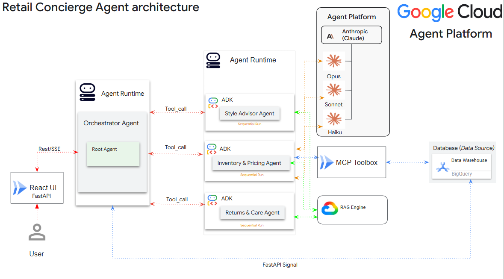

<!-- Copyright 2026 slarbi-web -->

# Vogue Concierge — System Architecture & Multi-Agent Design

This document provides a comprehensive technical overview of the **Vogue Concierge** multi-agent retail platform built on **Google Cloud Platform (GCP)** and powered by **Anthropic Claude models** via **Agent Platform Model Garden**.

---

## 🏛️ System Architecture Diagram



---

## 1. Executive Summary

Vogue Concierge is an enterprise AI luxury boutique concierge platform. The application combines:
* **Frontend UI:** A Next.js / React storefront (`/ui`).
* **FastAPI Backend Relay:** A Python FastAPI server (`app.py`) running on Google Cloud Run that handles REST/SSE chat streaming, user session management, and transactional database actions.
* **Agent Runtime:** A multi-agent ecosystem hosted on **Agent Runtime** using **Google Agent Development Kit (ADK)** and the official Anthropic SDK (`anthropic[vertex]`).
* **Data Layer:** A dual data architecture separating unstructured semantic search (**Agent Platform RAG Engine**) from structured database transactions (**Google BigQuery**).

---

## 2. Multi-Agent Orchestration Strategy

The system utilizes a **Hub-and-Spoke Orchestrator** pattern:

```
[ User / React UI ]
        │
        ▼ (REST / SSE)
 [ FastAPI Relay ]
        │
        ▼ (Agent Runtime Event Stream)
 [ Lead Orchestrator (Sonnet 4.6) ]
        │
        ├─────── Tool_call (Sequential) ───────┐
        ▼                                       ▼
  Style Advisor                      Inventory & Pricing                  Returns & Care
   (Opus 4.8)                            (Haiku 4.5)                       (Haiku 4.5)
```

### Key Orchestration Behaviors:
* **Hub-and-Spoke Hierarchy:** The Lead Orchestrator (`vogue_concierge`) receives incoming customer queries and delegates work to specialized sub-agents using ADK `AgentTool` definitions (native tool calls).
* **Sequential Turn Execution:** Inter-agent communication is sequential per conversation turn. Specialists return their findings back to the Orchestrator, which maintains a unified, polished concierge voice.
* **Parallel Tool Execution:** Within an individual specialist's execution loop, the underlying Claude model can issue parallel tool calls (e.g., querying product catalog and fashion trends simultaneously).

---

## 3. Agent Roster & Model-per-Agent Strategy

Each agent runs on the Claude model tier best optimized for its specific workload:

| Agent Name | LLM Model Tier | Assigned Tools | Functional Responsibility |
| :--- | :--- | :--- | :--- |
| **Vogue Concierge**<br>*(Lead Orchestrator)* | `claude-sonnet-4-6` | • `AgentTool(Style)`<br>• `AgentTool(Inventory)`<br>• `AgentTool(Returns)`<br>• Signal Tools (`place_order`, `check_stock`, `check_loyalty`, `quote_order`, `get_order`, `enroll_loyalty`) | Primary entry point. Handles greetings, maintains concierge voice, delegates to specialists, and manages top-level checkout signals. |
| **Style Advisor** | `claude-opus-4-8`<br>*(Effort: High)* | • `catalog_search`<br>• `trend_search` | Expert fashion stylist. Handles outfit composition, style trends, and personalized recommendations using high reasoning. |
| **Inventory & Pricing** | `claude-haiku-4-5` | • `catalog_search`<br>• `check_inventory` (MCP)<br>• `get_loyalty_discount` (MCP) | Fast, deterministic lookups for product specifications, catalog pricing, and inventory. |
| **Returns & Care** | `claude-haiku-4-5` | • `catalog_search` | Garment policy, returns, exchanges, and material-specific care advice. |

---

## 4. Data Plane Architecture: RAG vs. BigQuery

The architecture strictly delineates unstructured vector search from structured relational queries:

```
                          ┌──────────────────────────┐
                          │   Agent Platform RAG Engine   │
                          │  (Catalog Copy & Trends) │
                          └────────────▲─────────────┘
                                       │
                                       │ (Semantic Vector Queries)
                                       │
┌─────────────────────────┐   ┌────────┴─────────┐   ┌─────────────────────────┐
│   Style Advisor Agent   │   │ Inventory Agent  │   │  Returns & Care Agent   │
└─────────────────────────┘   └────────┬─────────┘   └─────────────────────────┘
                                       │
                                       │ (HTTP SQL Tools - Port 5000)
                                       ▼
                          ┌──────────────────────────┐
                          │    MCP Toolbox Service   │
                          │   (Cloud Run Microservice)│
                          └────────────┬─────────────┘
                                       │
                                       │ (SQL)
                                       ▼
                          ┌──────────────────────────┐
                          │     Google BigQuery      │
                          │ (Orders/Stock/Loyalty)   │
                          └──────────────────────────┘
```

### 1. Agent Platform RAG Engine
* **Purpose:** Stores vector embeddings of unstructured text assets, including seasonal trend reports (`trend_report.md`) and product catalog descriptions (`products.json`).
* **Access:** Accessed via python tool functions (`catalog_search` and `trend_search`) in all three specialist agents via `vertexai.preview.rag.retrieval_query`.

### 2. MCP Toolbox Cloud Run Service (`vogue-toolbox`)
* **Purpose:** A standalone Cloud Run microservice exposing Model Context Protocol (MCP) tool endpoints.
* **Access:** Used by `inventory_specialist` to execute parameterized SQL lookups against BigQuery `inventory` and `loyalty_program` tables.

### 3. Signal / Execute Pattern (`checkout.py`)
* **Purpose:** Executes transactional orders and account updates outside the Agent Runtime sandbox.
* **Access:** Because the Agent Runtime runtime sandbox cannot connect directly to BigQuery, tools like `place_order`, `check_stock`, and `check_loyalty` emit **signals** in the event stream. The FastAPI relay server on Cloud Run intercepts these events and executes real BigQuery queries via `checkout.py`.
